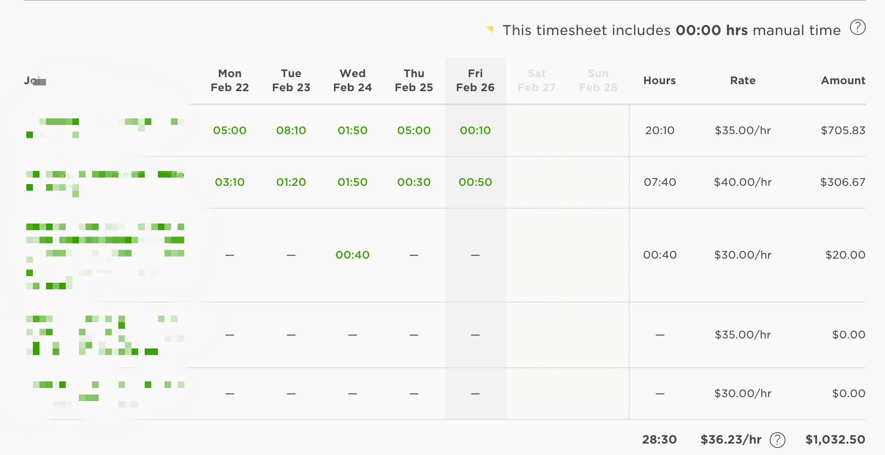
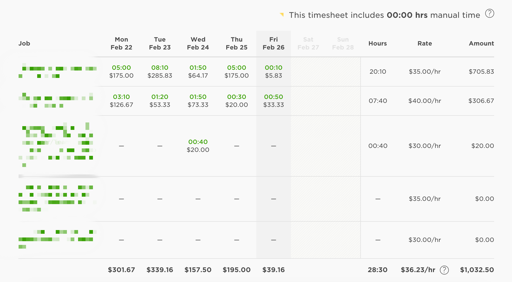

# Upwork Enhancements Chrome extension

Enhance UpWork interface.

## Changelog

**v0.3.0**:

* Removed wordwrap fixes as UpWork already fixed that
* Fixed daily & per-cell earnings as UpWork changed layout

**v0.2.0**:

* Added per-cell earnings at [https://www.upwork.com/reports/in-progress](https://www.upwork.com/reports/in-progress).
* Added daily earnings [https://www.upwork.com/reports/in-progress](https://www.upwork.com/reports/in-progress).

Before:

After:

**v0.1.0**:

* Fix date, amount and balance wordwrap bug at [https://www.upwork.com/reports/available](https://www.upwork.com/reports/available).
